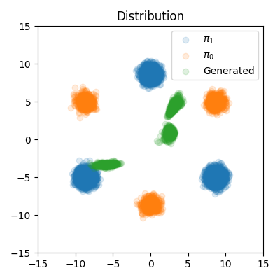
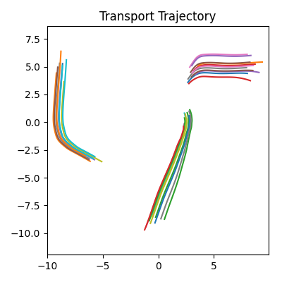
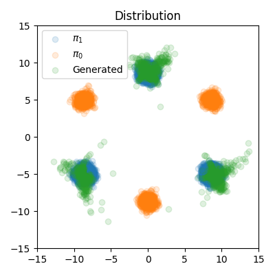
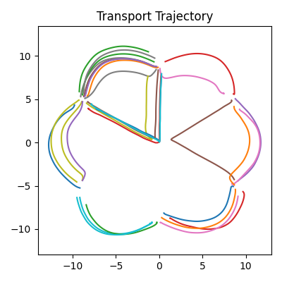

# Coding task for Second Order Rectified Flow
> We would like to implement the second order version of Rectified Flow.

## 1 Background

Rectified Flow is a method for generating trajectories from one distrbution to another. Please refer to [its original repo](https://github.com/gnobitab/RectifiedFlow) for more details.

In this code task, we only focus on the toy exmaple of Rectified Flow, which is also [the tutorial notebook](https://colab.research.google.com/drive/1CyUP5xbA3pjH55HDWOA8vRgk2EEyEl_P?usp=sharing) of the original Rectified Flow repo. 

## 2 Task Description

Please following the instruction [here](code_task_instructions.pdf) to complete the stage 1 and stage 2 of the code task.

***Please contact Zhizhou Sha (shazhizhou0@gmail.com) if you have any questions, or you encountered any obstacles!!!***

### 2.1 Expected Results

If you finish Stage 1, you should have the following results

  
  

If you finish Stage 2, you should have the following results

  
  

